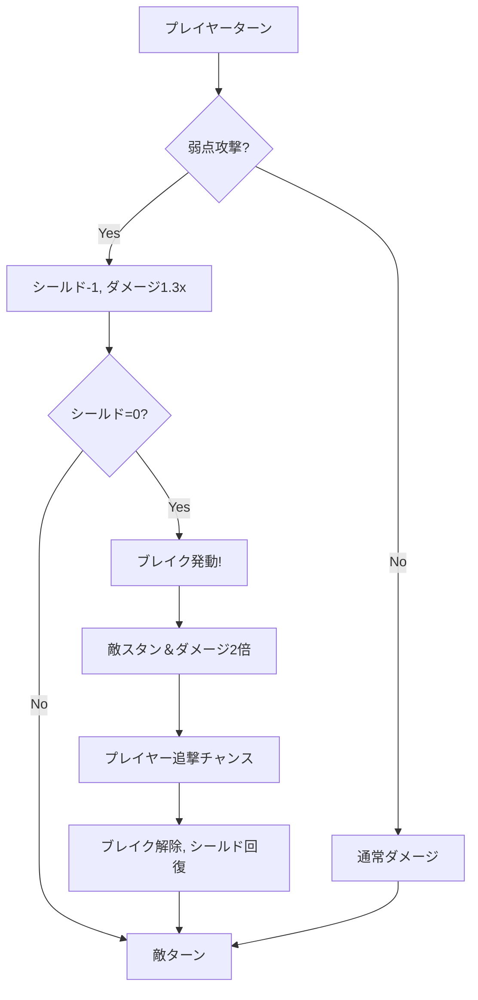

# 🏗️ 設計ドキュメント

> **Project**: BBQ (Bird Battle Quest)  
> **Version**: 0.1.0  
> **Last Updated**: 2025-12-13

---

## 1. アーキテクチャ概要

### 1.1 システム構成

```
┌─────────────────────────────────────────────────────────────┐
│                        Game (Phaser)                        │
├─────────────────────────────────────────────────────────────┤
│  Scenes                                                      │
│  ┌─────────┐ ┌──────────┐ ┌─────────┐ ┌──────────────────┐ │
│  │  Boot   │→│ Preload  │→│  Title  │→│      Map         │ │
│  └─────────┘ └──────────┘ └─────────┘ └────────┬─────────┘ │
│                                                 │            │
│                                     ┌───────────▼─────────┐ │
│                                     │      Battle         │ │
│                                     └─────────────────────┘ │
├─────────────────────────────────────────────────────────────┤
│  Systems                                                     │
│  ┌──────────┐ ┌──────────┐ ┌──────────┐ ┌──────────┐       │
│  │   Map    │ │  Battle  │ │   Save   │ │   UI     │       │
│  │  System  │ │  System  │ │  System  │ │  System  │       │
│  └──────────┘ └──────────┘ └──────────┘ └──────────┘       │
├─────────────────────────────────────────────────────────────┤
│  Entities                                                    │
│  ┌──────────┐ ┌──────────┐ ┌──────────┐ ┌──────────┐       │
│  │  Player  │ │   Enemy  │ │   Item   │ │   NPC    │       │
│  └──────────┘ └──────────┘ └──────────┘ └──────────┘       │
├─────────────────────────────────────────────────────────────┤
│  Data Layer                                                  │
│  ┌──────────────────────┐ ┌────────────────────────────┐    │
│  │  Game State Manager  │ │  LocalStorage (Save Data)  │    │
│  └──────────────────────┘ └────────────────────────────┘    │
└─────────────────────────────────────────────────────────────┘
```

### 1.2 設計原則

| 原則 | 説明 |
|------|------|
| **単一責任 (SRP)** | 各シーン/システムは1つの責任のみを持つ |
| **疎結合** | シーン間はデータ受け渡しで連携 |
| **ドキュメント駆動** | 仕様書とコードを同期 |
| **FF6参照駆動** | UIやゲームデザインはFF6を参考にする |

#### 🎮 FF6参考画像ルール

> **重要**: FF6風のUI/UX実装時は、以下の方法で参考画像を取得すること。
> 
> 1. **ユーザーに提供依頼** - 必要に応じてFF6の参考画像を依頼
> 2. **インターネット検索** - 必要に応じてWeb検索で参考画像を収集
> 
> 参考対象:
> - バトル画面レイアウト
> - メニュー画面デザイン
> - エフェクト・アニメーション
> - キャラクタースプライト比率
> 
> 参考画像を元に正確な再現を行う。

#### 🔧 リファクタリングルール

> **重要**: 基本機能の開発が完了したら、以下の手順でリファクタリングを実施すること。
> 
> 1. コードの整理・最適化
> 2. 重複コードの削除
> 3. 命名規則の統一
> 4. テストの実施（ユーザー確認不要、全て自動実行）
> 
> テストはユーザーに確認を求めず、全て実施する。

#### 🔍 GitHub検索ルール（車輪の再発明防止）

> **重要**: 新機能の実装を開始する前に、以下の手順でGitHubを検索すること。
> 
> **検索タイミング**
> 1. 新しいシステム/機能の実装開始前
> 2. 複雑なアルゴリズムや仕組みを実装する前
> 3. 外部ライブラリの導入を検討する前
> 
> **検索対象**
> - ATBバトルシステム実装
> - ブレイク/シールドシステム
> - Phaserプラグイン
> - ピクセルアートジェネレーター
> - タイルマップシステム
> 
> **検索キーワード例**
> ```
> "phaser atb battle system"
> "phaser rpg combat"
> "octopath traveler break system javascript"
> "pixel art generator typescript"
> ```
> 
> **評価基準**
> | 項目 | 確認内容 |
> |------|---------|
> | ライセンス | MIT, Apache 2.0 等の利用可能なライセンスか |
> | 更新頻度 | 最終更新が1年以内か、活発にメンテされているか |
> | スター数 | 一定の評価を得ているか（目安: 50+） |
> | 依存関係 | 本プロジェクトと互換性があるか |
> | コード品質 | TypeScript対応、テストの有無 |
> 
> **活用フロー**
> ```
> 1. GitHub検索で候補を特定
> 2. README/ドキュメントを確認
> 3. ライセンスを確認
> 4. サンプルコードを試す
> 5. 利用可能であれば導入、不可であれば参考にして実装
> ```
> 
> **結果の記録**
> - 検索した内容と結果をコミットメッセージまたはドキュメントに記録
> - 採用した場合はCHANGELOG.mdに依存関係として記載

### 1.3 Git/ブランチ戦略

> ⚠️ **重要**: 機能開発を開始する前に、必ずフィーチャーブランチを作成すること。

#### ブランチ命名規則

```
feature/<機能名>     # 新機能開発
bugfix/<バグ名>      # バグ修正
refactor/<対象>      # リファクタリング
docs/<ドキュメント名>  # ドキュメント更新
```

#### ワークフロー

```
main (安定版)
  ↓
  ├── feature/xxx ← 開発
  │     ↓
  │   PR/マージ → main
  │
  ├── feature/yyy ← 並行開発
  ...
```

#### フィーチャーブランチ対応表

| ブランチ名 | 機能 | 状態 |
|-----------|------|------|
| `feature/tilemap-system` | Tiledマップシステム | ✅ マージ済 |
| `feature/player-sprite` | 歩行アニメーション付きプレイヤースプライト | ✅ マージ済 |
| `feature/battle-improvements` | バトルUI改善、ダメージポップアップ | ✅ マージ済 |
| `feature/enemy-sprites` | 敵スプライト作成（スライム/コウモリ/ゴブリン） | 🔨 開発中 |
| `feature/shield-break` | オクトパストラベラー風シールド/ブレイクシステム | ⬜ 未着手 |
| `feature/party-system` | パーティシステム | ⬜ 未着手 |
| `feature/save-load` | セーブ/ロード機能 | ⬜ 未着手 |

---

## 2. モジュール設計

### 2.1 ディレクトリ構造

```
bbq/
├── src/
│   ├── main.ts                 # エントリーポイント
│   ├── config/
│   │   └── gameConfig.ts       # Phaser設定
│   ├── scenes/
│   │   ├── BootScene.ts        # 初期化シーン
│   │   ├── PreloadScene.ts     # アセットロード
│   │   ├── TitleScene.ts       # タイトル画面
│   │   ├── MapScene.ts         # フィールドマップ
│   │   └── BattleScene.ts      # バトル画面
│   ├── entities/               # (v0.2で追加)
│   │   ├── Player.ts           
│   │   ├── Enemy.ts            
│   │   └── Character.ts        
│   ├── systems/                # (v0.2で追加)
│   │   ├── BattleSystem.ts     
│   │   ├── EncounterSystem.ts  
│   │   └── SaveSystem.ts       
│   ├── ui/                     # (v0.2で追加)
│   │   ├── CommandMenu.ts      
│   │   └── HpBar.ts            
│   ├── data/                   # (v0.2で追加)
│   │   ├── enemies.json        
│   │   └── characters.json     
│   └── types/
│       └── index.ts            # 型定義
├── assets/
│   ├── images/
│   ├── audio/
│   └── maps/
├── public/
│   └── favicon.ico
├── .kiro/steering/             # SDD ドキュメント
├── docs/                       # 追加ドキュメント
└── .agent/workflows/           # AIワークフロー
```

### 2.2 モジュール一覧

| モジュール | 役割 | 依存先 |
|------------|------|--------|
| BootScene | 最小アセットロード | なし |
| PreloadScene | メインアセットロード | BootScene |
| TitleScene | タイトル表示、ゲーム開始 | PreloadScene |
| MapScene | フィールド移動、エンカウント | TitleScene |
| BattleScene | ターン制バトル | MapScene |

### 2.3 シーン間データフロー

```
TitleScene
    │
    │ scene.start('MapScene')
    ▼
MapScene ──────────────────────────────────────┐
    │                                          │
    │ エンカウント発生                          │
    │ scene.start('BattleScene', {             │
    │   enemyType: 'slime',                    │
    │   returnScene: 'MapScene',               │
    │   playerPosition: { x, y }               │
    │ })                                       │
    ▼                                          │
BattleScene                                    │
    │                                          │
    │ 勝利/逃走                                 │
    │ scene.start('MapScene', {                │
    │   playerPosition: { x, y }               │
    │ })                                       │
    └──────────────────────────────────────────┘
```

---

## 3. データ設計

### 3.1 主要データ構造

```typescript
// キャラクターステータス
interface CharacterStats {
  hp: number;
  maxHp: number;
  mp: number;
  maxMp: number;
  attack: number;
  defense: number;
  speed: number;
  level: number;
  exp: number;
}

// 敵データ
interface EnemyData {
  id: string;
  name: string;
  stats: CharacterStats;
  weakness: ElementType[];     // 弱点属性
  shieldPoints: number;        // シールド値
  drops: ItemDrop[];
  expReward: number;
  goldReward: number;
}

// オクトパストラベラー風バトルシステム用
interface BreakableEnemy extends EnemyData {
  shield: number;              // 現在のシールド
  maxShield: number;           // 最大シールド
  isBroken: boolean;           // ブレイク状態
  weaknesses: string[];        // 弱点リスト
}
```

### 3.2 永続化データ (LocalStorage)

| キー | 用途 | 形式 |
|------|------|------|
| `bbq_savedata` | セーブデータ | JSON |
| `bbq_settings` | 設定（音量等） | JSON |

### 3.3 セーブデータ構造

```typescript
interface SaveData {
  version: string;
  timestamp: number;
  party: PartyMember[];
  inventory: InventoryItem[];
  progress: {
    currentMap: string;
    position: { x: number; y: number };
    flags: Record<string, boolean>;
  };
  playtime: number;
}
```

---

## 3.5 FF6風ATBバトルシステム仕様

> **参考**: Final Fantasy VI Active Time Battle (ATB) System

### 3.5.1 ATBゲージ基本仕様

| 項目 | 仕様 |
|------|------|
| ゲージ表示 | パーティメンバーのみ表示（敵は非表示） |
| ゲージ最大値 | 100 |
| 行動可能条件 | ATBゲージが100に到達 |
| 行動後 | ATBゲージが0にリセット |

### 3.5.2 ATBゲージ回復速度

```typescript
// ATBゲージ回復式
atbRecoveryPerFrame = (baseSpeed + characterSpeed) * speedModifier;

// 例：baseSpeed = 0.3, characterSpeed = 10, speedModifier = 1.0
// → 1フレームあたり約0.4回復 → 約250フレーム（4秒程度）で満タン
```

#### スピードステータスの影響

| スピード値 | 回復速度 | 満タンまでの時間（目安） |
|-----------|---------|----------------------|
| 10（低速） | 0.4/frame | 約4秒 |
| 50（標準） | 0.8/frame | 約2秒 |
| 100（高速） | 1.3/frame | 約1.3秒 |

### 3.5.3 ステータス効果とATB

| ステータス | ATBへの影響 |
|-----------|------------|
| **ヘイスト** | 回復速度1.5倍 |
| **スロウ** | 回復速度0.5倍 |
| **ストップ** | ATB回復停止 |
| **戦闘不能(KO)** | ATBが0にリセット、回復停止 |
| **石化** | ATB回復停止 |
| **睡眠** | ATB回復停止 |

### 3.5.4 バトルモード

| モード | 説明 |
|-------|------|
| **アクティブ** | メニュー操作中もATBが進行。敵も攻撃してくる |
| **ウェイト** | メニュー操作中はATBが停止。戦略的な選択が可能 |

> MVP実装では**ウェイトモード**のみサポート

### 3.5.5 エンカウント種類とATB初期値

| エンカウント | パーティATB | 敵ATB | 特徴 |
|-------------|-----------|-------|------|
| **通常** | ランダム(30-70) | ランダム(30-70) | 標準的なエンカウント |
| **先制攻撃** | 100（満タン） | 0 | プレイヤー有利 |
| **バックアタック** | 0 | 100（満タン） | 敵有利、背後から攻撃 |
| **挟み撃ち** | 0 | ランダム | 敵に囲まれる |
| **サイドアタック** | 100（満タン） | 0 | プレイヤーが敵を囲む |

### 3.5.6 アクションチャージタイム

```
[ATB満タン] → [コマンド選択] → [チャージタイム] → [アクション実行]
```

| アクション | チャージタイム（フレーム） |
|-----------|----------------------|
| たたかう | 10 |
| まほう | 20-40（魔法による） |
| アイテム | 15 |
| ぼうぎょ | 0（即時） |
| にげる | 30 |

### 3.5.7 バトル画面レイアウト（FF6風）

```
┌─────────────────────────────────────────────────────────────┐
│                        バトル背景                           │
│                                                             │
│    [敵スプライト]              [パーティ4人]                 │
│        左側                    右側（斜め配置）              │
│                                                             │
│                                キャラ1（手前）               │
│                                  キャラ2                     │
│                                    キャラ3                   │
│                                      キャラ4（奥）           │
├─────────────────────────────────────────────────────────────┤
│ ┌──────────┐ ┌─────────────────────────────────────────────┐│
│ │ 敵名     │ │ キャラ名    HP     ATBゲージ               ││
│ ├──────────┤ │ とりくん    100    ████████████████████░░░ ││
│ │▶たたかう │ │ だいちゃん   80    ██████████████░░░░░░░░░ ││
│ │ ぼうぎょ │ │ しんいち    90    █████████░░░░░░░░░░░░░░ ││
│ │ にげる   │ │ たいさ     120    ███████░░░░░░░░░░░░░░░░ ││
│ └──────────┘ └─────────────────────────────────────────────┘│
└─────────────────────────────────────────────────────────────┘
```

### 3.5.8 パーティメンバー深度（重なり順）

| メンバー | 位置 | 深度 | 表示順 |
|---------|------|------|-------|
| 1人目 | 右上 | 100（最高） | 最前面 |
| 2人目 | ↓左下 | 90 | ↓ |
| 3人目 | ↓左下 | 80 | ↓ |
| 4人目 | 左下 | 70（最低） | 最背面 |

> **注意**: Phaserでは`setDepth(n)`の値が大きいほど手前に表示される

### 3.5.9 MVP実装範囲

| 機能 | MVP対応 | 備考 |
|------|---------|------|
| ATBゲージ表示 | ✅ | パーティ4人分（敵は内部計算） |
| ATB回復 | ✅ | `(base + speed/100)`で計算 |
| 攻撃でATBリセット | ✅ | 0にリセット |
| ウェイトモード | ✅ | メニュー中・演出中は停止 |
| 敵ATBシステム | ✅ | 敵もATBでターン管理 |
| ランダムターゲット | ✅ | 敵は生存者をランダム攻撃 |
| アクティブモード | ⬜ | 将来実装 |
| ステータス効果 | ⬜ | 将来実装 |
| エンカウント種類 | ⬜ | 将来実装（現在はランダム初期値のみ） |
| チャージタイム | ⬜ | 将来実装 |

### 3.5.10 実装上の注意点

1. **深度問題**: スプライトの重なり順はPhaserの`setDepth()`で制御。大きな値（100単位）で差をつけること
2. **ATBバー幅**: 固定幅（80px）で描画し、超過しないよう`Math.min()`でクランプ
3. **パフォーマンス**: `update()`での毎フレーム処理は最小限に抑える
4. **UI座標**: ハードコーディングせず、定数化して管理する

---

## 3.6 オクトパストラベラー風ブレイクシステム仕様

> **参考**: Octopath Traveler Break Shield System

### 3.6.1 基本概念

敵には「シールドポイント」と「弱点」が設定されており、弱点を突くことでシールドを削り、0になると「ブレイク状態」になる。

```
[敵シールド: 5] → [弱点攻撃×5回] → [ブレイク！] → [2倍ダメージ＆行動不能]
```

### 3.6.2 シールドポイント

| 項目 | 仕様 |
|------|------|
| 表示 | 敵の下に青いシールドアイコン + 数字 |
| 範囲 | 1〜10（敵の強さによる） |
| 削減条件 | 弱点属性/武器で攻撃 |
| 削減量 | 1ヒットにつき1（マルチヒットで複数削減可能） |
| ブレイク条件 | シールドポイントが0になる |
| 回復 | ブレイク解除後、最大値に戻る |

### 3.6.3 弱点システム

#### 弱点の種類

| カテゴリ | 種類 |
|---------|------|
| **武器** | 剣、槍、短剣、斧、弓、杖、本、扇 |
| **属性** | 火、氷、雷、風、光、闇 |

> MVP実装では簡略化: **剣、弓、魔法（火/氷/雷）**のみ

#### 弱点の表示

```
敵名: ゴブリン
シールド: ●●●●● (5)
弱点: [剣] [?] [?] [火] [?]
       ↑発見済   ↑未発見
```

#### 弱点の発見方法

| 方法 | 説明 |
|------|------|
| **試行錯誤** | 弱点属性で攻撃すると発見＆シールド削減 |
| **分析スキル** | 「みやぶる」で弱点1つを発見（SP消費） |
| **戦闘開始時** | 一部キャラは自動で弱点1つを発見 |

#### 弱点ダメージボーナス

| 状態 | ダメージ倍率 |
|------|------------|
| 弱点でない攻撃 | 1.0x（等倍） |
| 弱点攻撃 | 1.3x（30%増加） |
| ブレイク中の攻撃 | 2.0x（2倍） |
| ブレイク中＋弱点 | 2.0x（弱点ボーナスは適用されない） |

### 3.6.4 ブレイク状態

| 項目 | 仕様 |
|------|------|
| 発動条件 | シールドポイントが0になる |
| 効果1 | 敵は次のターンまで行動不能（スタン） |
| 効果2 | 受けるダメージが2倍 |
| 持続時間 | 敵の次のターン終了まで |
| 解除後 | シールドポイントが最大値に回復 |

#### ブレイク時のビジュアル演出

```
1. シールドが砕けるエフェクト
2. 敵が揺れる＆色が暗くなる
3. 「BREAK!」のテキスト表示
4. 敵の頭上に「スタン」アイコン表示
```

### 3.6.5 ブーストポイント（BP）システム

> オプション: MVP後に実装検討

| 項目 | 仕様 |
|------|------|
| 最大蓄積 | 5 BP |
| 獲得 | 1ターンにつき1 BP |
| 消費 | アクション選択時に0〜3 BP使用可能 |
| 効果（通常攻撃） | BP数だけ追加ヒット（シールド削りに有効） |
| 効果（スキル） | ダメージや効果が増加 |
| バトル終了時 | BPはリセットされない → 次のバトルに持ち越し不可 |

### 3.6.6 敵データ構造

```typescript
interface BreakableEnemy {
    id: string;
    name: string;
    
    // 基本ステータス
    hp: number;
    maxHp: number;
    attack: number;
    defense: number;
    
    // ブレイクシステム
    shield: number;              // 現在のシールドポイント
    maxShield: number;           // 最大シールドポイント
    weaknesses: WeaknessType[];  // 弱点リスト（順番固定）
    revealedWeaknesses: boolean[]; // 発見済みフラグ
    isBroken: boolean;           // ブレイク状態かどうか
    breakRecoveryTurn: number;   // ブレイク解除までのターン数
    
    // ドロップ
    expReward: number;
    goldReward: number;
    drops: ItemDrop[];
}

type WeaknessType = 
    | 'sword' | 'spear' | 'dagger' | 'axe' | 'bow' | 'staff'
    | 'fire' | 'ice' | 'lightning' | 'wind' | 'light' | 'dark';
```

### 3.6.7 弱点の表示順序（固定）

```
剣 > 槍 > 短剣 > 斧 > 弓 > 杖 > 本 > 扇 > 火 > 氷 > 雷 > 風 > 光 > 闇
```

> 敵の弱点はこの順序で表示され、未発見は「?」マーク

### 3.6.8 バトルUI（ブレイクシステム対応）

```
┌─────────────────────────────────────────────────────────────┐
│                        バトル背景                           │
│                                                             │
│    [敵スプライト]                                           │
│    ゴブリン                                                 │
│    ●●●●● (5)  ← シールドポイント                          │
│    [剣][?][?][火][?] ← 弱点（発見済み/未発見）              │
│                                                             │
│                                [パーティ4人]                │
├─────────────────────────────────────────────────────────────┤
│ ┌──────────┐ ┌─────────────────────────────────────────────┐│
│ │ 敵名     │ │ キャラ名    HP     ATBゲージ               ││
│ ├──────────┤ │ とりくん    100    ████████████████████░░░ ││
│ │▶たたかう │ │ だいちゃん   80    ██████████████░░░░░░░░░ ││
│ │ とくぎ   │ │ しんいち    90    █████████░░░░░░░░░░░░░░ ││
│ │ にげる   │ │ たいさ     120    ███████░░░░░░░░░░░░░░░░ ││
│ └──────────┘ └─────────────────────────────────────────────┘│
└─────────────────────────────────────────────────────────────┘
```

### 3.6.9 戦闘フロー（ブレイク込み）



### 3.6.10 MVP実装範囲

| 機能 | MVP対応 | 備考 |
|------|---------|------|
| シールドポイント表示 | ✅ | 敵の下に数字で表示 |
| 弱点表示 | ✅ | アイコンで表示（発見済み/未発見） |
| 弱点攻撃でシールド削減 | ✅ | 1ヒット=1削減 |
| 弱点ダメージボーナス | ✅ | 1.3倍 |
| ブレイク状態 | ✅ | スタン＆ダメージ2倍 |
| ブレイク時演出 | ✅ | シールド破壊エフェクト |
| BP（ブーストポイント） | ⬜ | 将来実装 |
| マルチヒット攻撃 | ⬜ | 将来実装 |
| 分析スキル | ⬜ | 将来実装 |

### 3.6.11 実装上の注意点

1. **弱点判定**: 攻撃属性と敵の弱点リストを照合
2. **シールド表示更新**: シールド削減時にアニメーション付きで更新
3. **ブレイク状態管理**: `isBroken`フラグと`breakRecoveryTurn`で制御
4. **ダメージ計算順序**: 弱点ボーナス → ブレイクボーナス（ブレイク中は弱点ボーナス無効）
5. **UI更新**: シールドと弱点の表示は敵スプライトの下に固定配置

---

## 4. UI設計

### 4.1 解像度とスケーリング

| 設定 | 値 |
|------|-----|
| ゲーム内部解像度 | 480 x 320 |
| スケーリング | FIT (アスペクト比維持) |
| ピクセルパーフェクト | 有効 |
| タイルサイズ | 16 x 16 |

### 4.2 スプライト仕様（FF6/FFRK風）

> 参考: https://dotartplay.com/ff-dot-new

#### キャラクタースプライト

| 項目 | 値 | 備考 |
|------|-----|------|
| **サイズ** | 16 x 24 | FF6/FFRK標準 |
| **頭の高さ** | 約13px | プロポーション比率 |
| **体の高さ** | 約5px | |
| **足の高さ** | 約5-6px | |
| **色数** | 8-16色/キャラ | パレット制限 |

#### 色調ガイドライン

- **液晶対応**: SFC版より明るめの色を使用
- **ハイライト**: 光源を意識した明暗表現
- **アウトライン**: 暗めの色で輪郭を強調

#### 敵スプライト

| 敵タイプ | サイズ | 備考 |
|----------|--------|------|
| 小型（スライム等） | 24 x 24 〜 32 x 32 | |
| 中型（ゴブリン等） | 32 x 32 〜 48 x 48 | |
| 大型（ボス等） | 64 x 64 〜 96 x 96 | v0.3以降 |


### 4.2 画面一覧

| 画面ID | 画面名 | 説明 |
|--------|--------|------|
| S-001 | TitleScene | タイトル画面 |
| S-002 | MapScene | フィールド移動 |
| S-003 | BattleScene | バトル画面 |
| S-004 | MenuScene | メニュー画面 (v0.2) |

### 4.3 カラーパレット

```css
/* メインカラー */
--color-primary: #e94560;    /* 赤（アクセント） */
--color-secondary: #4ade80;  /* 緑（プレイヤー） */
--color-accent: #fbbf24;     /* 金（ハイライト） */

/* 背景 */
--color-bg-dark: #1a1a2e;
--color-bg-mid: #16213e;
--color-bg-light: #0f3460;

/* テキスト */
--color-text: #ffffff;
--color-text-muted: #a0a0a0;
```

### 4.4 フォント
- **UI/メニュー**: Press Start 2P (Google Fonts)
- **本文**: システムフォント (fallback)

---

## 5. バトルシステム設計

### 5.1 ダメージ計算式

```
基本ダメージ = 攻撃力 - 防御力 / 2
最終ダメージ = max(1, 基本ダメージ * 乱数(0.9~1.1))

ぼうぎょ時: 最終ダメージ = 最終ダメージ / 2
ブレイク時: 最終ダメージ = 最終ダメージ * 1.5
```

### 5.2 シールド/ブレイクシステム (v0.2)

```
シールドポイント (SP): 敵ごとに設定
弱点攻撃時: SP -= 1
SP == 0: ブレイク状態

ブレイク状態:
- 1ターン行動不能
- 被ダメージ 1.5倍
- ターン終了後 SP 全回復
```

### 5.3 コマンド一覧

| コマンド | 説明 | MVP |
|---------|------|-----|
| たたかう | 通常攻撃 | ✅ |
| ぼうぎょ | 被ダメージ半減 | ✅ |
| にげる | 50%で逃走成功 | ✅ |
| アビリティ | スキル使用 | v0.2 |
| アイテム | アイテム使用 | v0.2 |

---

## 6. 入力設計

### 6.1 マップ画面

| 入力 | アクション |
|------|----------|
| WASD / 矢印キー | 移動 |
| ESC | タイトルに戻る |
| B | バトル画面へ（デバッグ） |

### 6.2 バトル画面

| 入力 | アクション |
|------|----------|
| W / ↑ | コマンド上移動 |
| S / ↓ | コマンド下移動 |
| SPACE / ENTER / Z | 決定 |

---

*このドキュメントは技術的な設計判断の記録として使用されます。*
